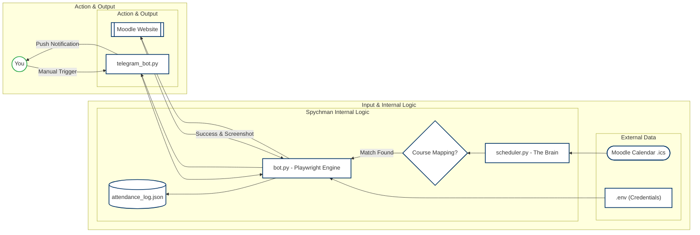

<p align="center">

</p>


# **Spychman 🕵️‍♂️**

**Spychman** is a robust, **Python-powered** automation tool designed for students at **Reichman University**. It integrates with your **Moodle account** and academic calendar to automatically (or remotely) handle attendance marking.

Built with **Playwright**, it mimics human behavior to navigate Moodle's interface, bypasses standard detection with **randomized interactions**, and reports back to you via **Telegram** with photographic evidence.

<p align="center">

</p>

---

## **🚀 Key Features**

* **Smart Scheduling:** Automatically fetches your **ICS calendar** and identifies classes starting within a **20-minute window**.
* **Telegram Integration:** Remote control your attendance via a dedicated **Telegram bot**. Get reports and screenshots sent directly to your phone.
* **Human-Like Interaction:** Uses **variable typing speeds**, mouse hovers, and **randomized delays** to navigate Moodle like a real person.
* **Dual-Mode Execution:** Run it **manually** from your terminal or leave it active as a persistent **Telegram listener**.
* **Evidence Collection:** Every successful (or failed) attempt captures a **full-page screenshot** for your peace of mind.
* **Israel Timezone Support:** Hardcoded for **`Asia/Jerusalem`** to ensure the schedule matches campus time perfectly.


---

## **🛠️ Tech Stack**

* **Language:** **Python 3.9+**
* **Automation:** **[Playwright](https://playwright.dev/python/)** (Chromium)
* **Calendar:** **`ics`** & **`pytz`**
* **Interface:** **`python-telegram-bot`**
* **Environment:** **`python-dotenv`**

---

## **📦 Installation**

1.  **Clone the repository:**
    ```bash
    git clone [https://github.com/YOUR_USERNAME/spychman.git](https://github.com/YOUR_USERNAME/spychman.git)
    cd spychman
    ```

2.  **Install dependencies:**
    ```bash
    pip install -r requirements.txt
    ```

3.  **Install Playwright Browsers:**
    ```bash
    playwright install chromium
    ```

---

## **⚙️ Configuration**

Create a **`.env`** file in the root directory and fill in your credentials:

```ini
# Moodle Credentials
MOODLE_USER=your_moodle_username
MOODLE_PASS=your_moodle_password

# Calendar Link (Exported from Moodle)
ICS_URL=[https://moodle.runi.ac.il/.../export_execute.php](https://moodle.runi.ac.il/.../export_execute.php)...

# Telegram Bot (Get from @BotFather and @userinfobot)
TELEGRAM_TOKEN=123456789:ABCdefGHI...
TELEGRAM_CHAT_ID=987654321
```

---

## **🕹️ Usage**

1.  **Manual Mode (CLI):**
   
    To run a one-time check from your computer:
    ```bash
    python main.py
    ```
    

2.  **Telegram Mode (Remote)**
   
    To Activate the Telegram bot listener:
    ```bash
    python telegram_bot.py
    ```
    
    Once active, just hit the "🚀 Run Attendance Check" button in your Telegram chat.

----

## **🏗️ Project Structure**

- ```main.py```: The bridge between the schedule logic and the bot execution.

- ```bot.py```: The *Playwright "engine"* that handles browser navigation.

- ```scheduler.py```: Logic for parsing the *ICS calendar* and finding active classes.

- ```telegram_bot.py```: The *Telegram interface* and message handler.

- ```state.py```: Manages the local ```attendance_log.json``` to prevent double-marking.

- ```config.py```: Centralized configuration and ***course ID mapping***.

----

## **🚧 Disclaimer**

This project is for *educational purposes only*. The author is not responsible for any academic consequences or misuse of this tool.
Use it responsibly and ensure you are actually participating in the courses you mark yourself present for.

----

**Made with ❤️ by Ori**

_Medical Student @ Reichman University_
